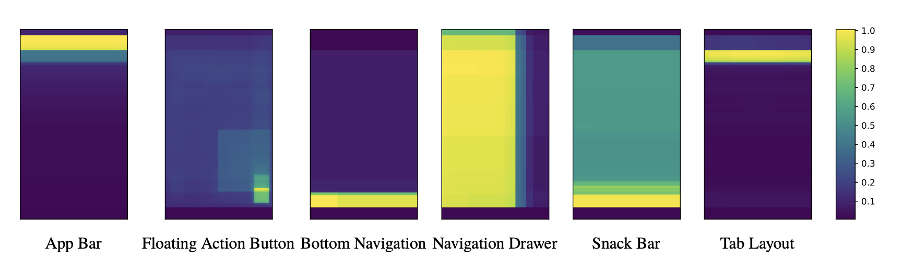

[Email](mailto:dongtao@acm.org) \| [Google Scholar](https://scholar.google.com/citations?user=HYU9v0QAAAAJ&hl=en) \| [LinkedIn](https://www.linkedin.com/in/dongtao) \| [Blog](https://taodong.medium.com/) \| [X](https://x.com/taodong) \| [AI Papers Reader](https://ai-papers-reader.taodong.net)

## Hi there 👋
I’m a Human-Computer Interaction researcher, User Experience Lead, and keynote speaker. My current focus is applying AI to the full lifecycle of software engineering. Previously, I founded and led the UX team for Google's programming frameworks and languages group, including beloved open-source projects such as [Flutter](https://flutter.dev/), [Dart](https://dart.dev/), and [Go](https://go.dev/).

I received my PhD from the [School of Information](http://www.si.umich.edu) at the University of Michigan in 2015. 
For my [doctoral research](http://deepblue.lib.umich.edu/handle/2027.42/111448), I conducted ethnographic studies, designed and prototyped systems, and ran field trials of ubiquitous computing technologies. I was co-advised by [Prof. Mark Ackerman](https://www.si.umich.edu/people/mark-ackerman) and [Prof. Mark Newman](https://www.si.umich.edu/people/mark-newman).

## Select Projects

### API Usability

The usability of API can make or break a developer's productivity. At DevXcon 2018, I talked about how to apply UX principles and methods to API usability. Learn more: [Transcript](https://devrel.net/developer-experience/how-to-apply-ux-principles-and-methods-to-api-usability),
[Slides](https://docs.google.com/presentation/d/1vkVGdmeQyp8uQkc35iwGGXV0nFCZqnVELSkFY4WdU7w/edit#slide=id.g3add037ebf_0_3), [Blog Post](https://medium.com/google-design/how-i-do-developer-ux-at-google-b21646c2c4df).

    <iframe width="560" height="315" src="https://www.youtube.com/embed/Zx732oQN_Rs" frameborder="0" allow="accelerometer; autoplay; encrypted-media; gyroscope; picture-in-picture" allowfullscreen></iframe>

### Presentation of Error Messages

Programmatic errors are often difficult to resolve due to poor usability of error messages.
Applying theories of visual perception and techniques in visual design, we were able to substantially improve both error comprehension and resolution in an experiment. Learn more: [Paper (CHI ’19)](https://dl.acm.org/doi/10.1145/3290607.3312978?cid=99659035732), [Blog Post](https://medium.com/flutter/improving-flutters-error-messages-e098513cecf9).

    <iframe width="560" height="315" src="https://www.youtube.com/embed/whcdZf8VMdo" frameborder="0" allow="accelerometer; autoplay; encrypted-media; gyroscope; picture-in-picture" allowfullscreen></iframe>

### Interactive Coding Tutorials

We set out to develop a pattern language for designing interactive coding tutorials through a user-centered design process. We created and evolved three instructional patterns and their supporting interaction components and [launched an interactive tutorial](https://dart.dev/codelabs/async-await) about Dart asynchronous programming. Learn more: [Best Practices Guide](https://dart.dev/resources/dartpad-best-practices), [Paper @ \<Programming\> ’20](https://doi.org/10.1145/3397537.3397558).

### Programming Education via Live Streaming
Live streaming is an emerging practice for teaching and learning computer programming. 
What's unique about this medium, compared with pre-recorded videos? 
Read our paper to find out. Learn more: [Paper @ CSCW ’20](https://drive.google.com/file/d/13ybnyXf41FcKr9uvJD0W74euG5sriNR0/view?usp=sharing).

    <iframe width="560" height="315" src="https://www.youtube.com/embed/GOumcQgdnXQ" frameborder="0" allow="accelerometer; autoplay; clipboard-write; encrypted-media; gyroscope; picture-in-picture" allowfullscreen></iframe>

### Evaluating a Design System at Scale
Material Design is a Design System introduced by Google in 2014, but did it help elevating the UX of apps in the Android ecosystem? We analyzed thousands of Android apps using machine learning and computer vision techniques and found that use of Material Design was positively correlated with high app ratings and large numbers of app installs. Learn more: [Paper](https://arxiv.org/pdf/1807.04191.pdf).

### Multi-device Experiences – A Design Ideation Toolkit

How do devices take on different roles in ad-hoc multi-device configurations, and how do changes in the user's context influence device roles and privacy considerations? This kit helps designers incorporate these considerations into product design. Learn more: [Microsite](https://sites.google.com/view/mckit), [Paper @ DIS ’17](http://dl.acm.org/citation.cfm?doid=3064663.3064768).

### Multi-device Experiences – Developer Challenges

Why is building multi-device experiences so hard? Learn what I found from interviewing designers and developers. Learn more: [Paper @ DIS ’16](http://dx.doi.org/10.1145/2901790.2901851).

Projects below are from my pre-Google days.

### Activity Traces in the Home

Home Trivia is an experimental system which uses activity traces, games, and sensors to help families better understand how they spend time at home. Learn more: [Paper @ UbiComp ’15](https://drive.google.com/file/d/0B3ZUNRRaVZ8na3lUM3RwSmx5VFE/view?usp=sharing).

    <iframe width="560" src="https://www.youtube.com/embed/TBDSEEFmEew" frameborder="0" allowfullscreen></iframe>

### House Memory: "If these walls could talk..." ###
Through a field study and a design exercise, I explored the potential value of activity traces captured by sensors in domestic environments. Learn more: [Article @ ACM Interactions](https://drive.google.com/file/d/0B3ZUNRRaVZ8nQUpQemt0aU81ZHc/view), [Paper @ DIS ’14](https://drive.google.com/file/d/0B3ZUNRRaVZ8nSHFDR21IRDlMSUE/view) (Best Paper Nominee).

### Social Web Annotations and Modifications

Social Overlays is an experimental system to enable users to fix usability problems on live websites and share their modifications with other site visitors. Learn more: [Paper @ Interact ’13](https://doi.org/10.1007/978-3-642-40498-6_21).

    <iframe width="560" height="315" src="https://www.youtube.com/embed/PlysPcqyRt0" frameborder="0" allowfullscreen></iframe>

### Learning Complex Software via Gaming ###
Jigsaw is a discovery-based learning game for Photoshop based on the jigsaw puzzle metaphor. Learn more: [Paper @ CHI ’12](https://drive.google.com/file/d/0B3ZUNRRaVZ8ncEZkVFRvMUtvNUU/view).

<!-- CHI2012 \[[ACM](http://dl.acm.org/citation.cfm?id=2208358) -->

    <iframe width="560" height="315" src="https://www.youtube.com/embed/OwEPxmm_BTY" frameborder="0" allowfullscreen></iframe>

If you don't have access to the ACM Digital Library, you can download the preprint versions of my papers on [Google Drive](https://drive.google.com/folderview?id=0B3ZUNRRaVZ8nfkVHdzdOM3ZKQmZHMGl1SWowQU9GQnVWakM5YTQ2UGZJcnQ3d3ZQcjFOZ1U&usp=sharing).
