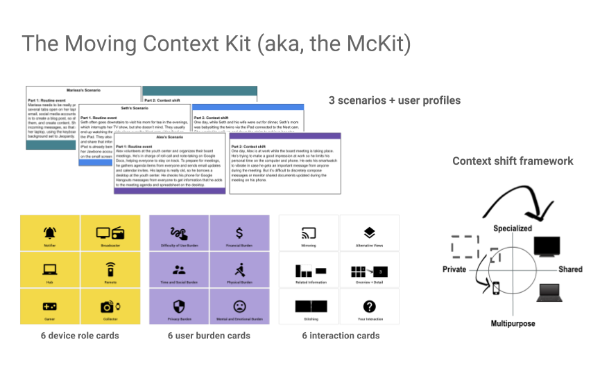
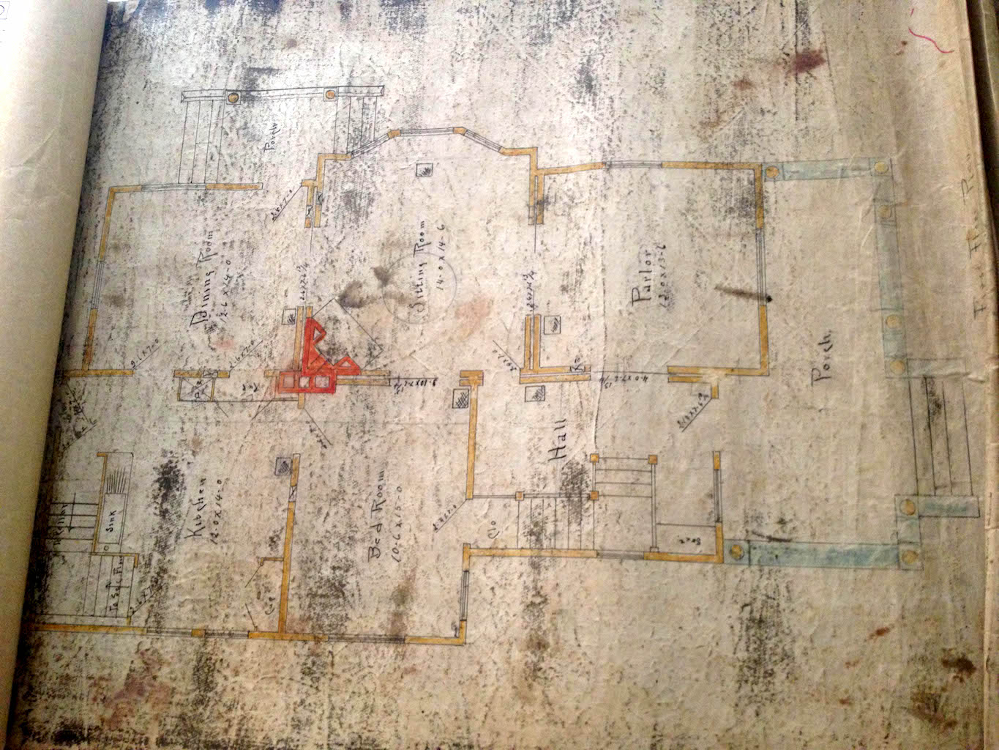

[dongtao@acm.org](mailto:dongtao@acm.org) \| [Google Scholar](https://scholar.google.com/citations?user=HYU9v0QAAAAJ&hl=en) \| [LinkedIn](https://www.linkedin.com/in/dongtao) \| [Twitter](https://twitter.com/taodong)

## Hello!

I am a researcher in [Human-Computer Interaction](https://www.interaction-design.org/literature/topics/human-computer-interaction). Currently employed as a User Experience Researcher at Google, my work is focused on API usability and programming tools, specifically for [Flutter](https://flutter.io/), an opensource UI framework.

I received my PhD from the [School of Information](http://www.si.umich.edu) at the [University of Michigan](http://www.umich.edu). My PhD thesis is entitled [Designing Reflective User Experience with Social and Ubiquitous Computing Technologies](http://deepblue.lib.umich.edu/handle/2027.42/111448). In graduate school, I was co-advised by [Prof. Mark Ackerman](https://www.si.umich.edu/people/mark-ackerman) and [Prof. Mark W. Newman](https://www.si.umich.edu/people/mark-newman).

## Select Research Projects

### API Usability ###
The usability of API can makes or breaks the developer's productivity. At DevXcon 2018, I talked about how to apply UX principles and methods to API usability ([Transcript](https://devrel.net/developer-experience/how-to-apply-ux-principles-and-methods-to-api-usability)).

    <iframe width="560" height="315" src="https://www.youtube.com/embed/Zx732oQN_Rs" frameborder="0" allow="accelerometer; autoplay; encrypted-media; gyroscope; picture-in-picture" allowfullscreen></iframe>

### The Moving Context Kit (McKit)
How do devices take on different roles in ad-hoc multi-device configurations, and how do changes in the user's context influence device roles and privacy considerations? This kit helps designers incorporate these considerations into product design. Learn more at [sites.google.com/corp/view/mckit](https://sites.google.com/corp/view/mckit). Publication: DIS2017 \[[ACM](http://dl.acm.org/citation.cfm?doid=3064663.3064768)]

### Multi-device Experiences
Why is building multi-device experiences so hard? Learn what I found from interviewing designers and developers. Publication: DIS2016 \[[ACM](http://dx.doi.org/10.1145/2901790.2901851), [PDF](https://drive.google.com/open?id=0B3ZUNRRaVZ8nTlNIUW1waGJFZG8)\]

### Home Trivia
Home Trivia is an experimental system which uses activity traces, games, and sensors to help families better understand how they spend time at home. Publication: UbiComp2015 \[[ACM](http://dl.acm.org/citation.cfm?id=2804294), [PDF](https://drive.google.com/file/d/0B3ZUNRRaVZ8na3lUM3RwSmx5VFE/view?usp=sharing)\]

    <iframe width="560" height="420" src="https://www.youtube.com/embed/TBDSEEFmEew" frameborder="0" allowfullscreen></iframe>

### House Memory: "If these walls could talk..." ###
Through a field study and a design exercise, I explored the potential value of activity traces captured by sensors in domestic environments. Publications: Interactions \[[ACM](http://dl.acm.org/citation.cfm?doid=2654824), [PDF](https://drive.google.com/file/d/0B3ZUNRRaVZ8nQUpQemt0aU81ZHc/view)\], DIS2014 - Best Paper Nominee \[[ACM](http://dl.acm.org/citation.cfm?id=2598605), [PDF](https://drive.google.com/file/d/0B3ZUNRRaVZ8nSHFDR21IRDlMSUE/view)\]

### Social Overlays ###
Social Overlays is an experimental system to enable users to fix usability problems on live websites and share their modifications with other site visitors. Publication: Interact2013 \[[Springer](http://link.springer.com/chapter/10.1007/978-3-642-40498-6_21#page-1), [PDF](https://drive.google.com/file/d/0B3ZUNRRaVZ8nN1kwejFfR2liOHc/view)\]

    <iframe width="560" height="315" src="https://www.youtube.com/embed/PlysPcqyRt0" frameborder="0" allowfullscreen></iframe>

### Jigsaw ###
Jigsaw is a discovery-based learning game for Photoshop based on the jigsaw puzzle metaphor. Publication: CHI2012 \[[ACM](http://dl.acm.org/citation.cfm?id=2208358), [PDF](https://drive.google.com/file/d/0B3ZUNRRaVZ8ncEZkVFRvMUtvNUU/view)\]

    <iframe width="560" height="315" src="https://www.youtube.com/embed/OwEPxmm_BTY" frameborder="0" allowfullscreen></iframe>

If you don't have access to the ACM Digital Library, you can download the preprint versions of my papers on [Google Drive](https://drive.google.com/folderview?id=0B3ZUNRRaVZ8nfkVHdzdOM3ZKQmZHMGl1SWowQU9GQnVWakM5YTQ2UGZJcnQ3d3ZQcjFOZ1U&usp=sharing).